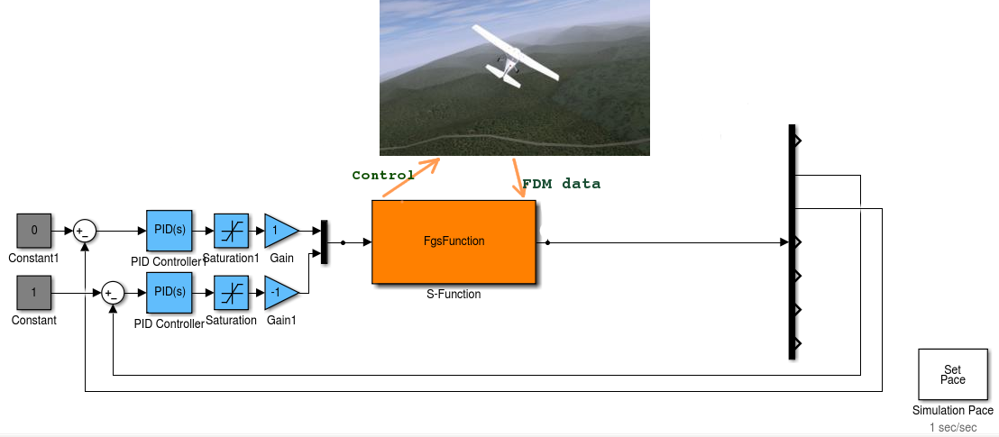

# FlightGear_S-function

Matlab s-function for interacting with FlightGear's FDM.

# How to use

Read quick start instructions on [wiki](https://github.com/approximator/FlightGear_S-function/wiki/How-to-start)
